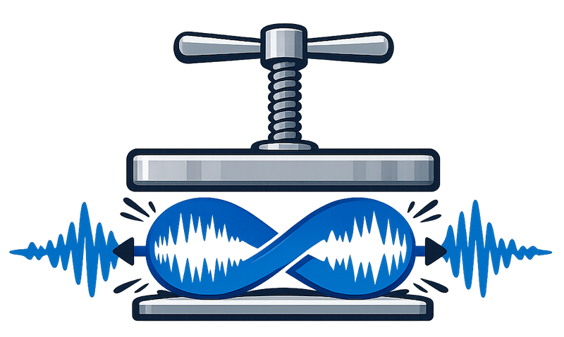

# wav-loop-resampler

Resample and/or process WAV files while preserving loop points.

## Features
- Preserve `smpl` loop points (scaling them when resampling)
- Resample to a target rate (optional)
- Mono downmix (optional)
- Bit depth conversion with TPDF dither (optional)
- Peak normalization (optional)



## Requirements
- Python 3.8+

Install dependencies:
```bash
python3 -m pip install numpy scipy soundfile
```

## Usage
```bash
python3 wav_loop_resampler.py input.wav
```

Options:
- `--rate <Hz>`: resample to target rate (omit to keep original rate)
- `--mono`: downmix to mono
- `--bit-depth <8|16|24|32>`: output PCM bit depth (TPDF dither applied)
- `--normalize`: peak-normalize to -0.01 dBFS before dither
- `--output <path>`: output file path

Default output name:
```
<input>[_<rate>Hz][_mono][_8bit].wav
```

## Examples
Resample to 22050 Hz and keep loops:
```bash
python3 wav_loop_resampler.py input.wav --rate 22050
```

Mono + 8-bit with normalization:
```bash
python3 wav_loop_resampler.py input.wav --mono --bit-depth 8 --normalize
```
